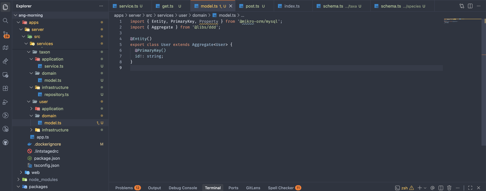

# Naviary Sanctuary Theme

Naviary Sanctuary Theme is a calm theme collection for Visual Studio Code, designed around the Naviary brand palette.

It uses low-glare surfaces for long coding sessions, with warm orange accents for active states, focus, and important UI signals.



## Themes

This extension includes four themes:

- **Naviary Light**: a clean light theme with crisp surfaces and warm orange accents.
- **Naviary Pastel Light**: a softer ivory light theme with warmer, low-glare surfaces.
- **Naviary Pastel Dark**: a softer dark theme with muted pastel accents.
- **Naviary Dark**: a stronger dark theme with clearer contrast and warmer highlights.

## Design Principles

- Comfortable backgrounds for extended reading and editing.
- Selective orange accents for focus, activity, and primary actions.
- Balanced syntax colors that keep code structure readable without visual noise.
- Subtle UI contrast for sidebars, panels, selections, and editor chrome.

## Installation

After publishing, install the extension from the Visual Studio Code Marketplace by searching for:

```text
Naviary Sanctuary Theme
```

Then open the command palette and run:

```text
Preferences: Color Theme
```

Choose **Naviary Light**, **Naviary Pastel Light**, **Naviary Pastel Dark**, or **Naviary Dark**.

## Local Development

Open this folder in Visual Studio Code and press `F5` to launch an Extension Development Host.

In the new VS Code window, open the command palette, run `Preferences: Color Theme`, and select one of the Naviary themes.

## License

MIT
